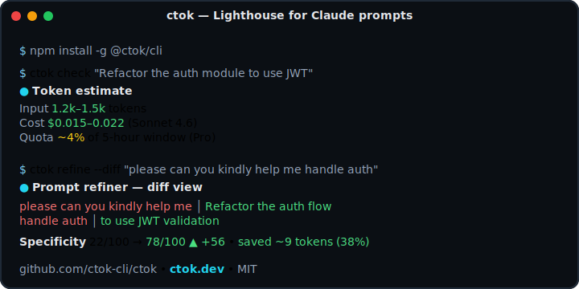

# ctok - Lighthouse for Claude prompts

**Estimate tokens, cut costs, and pick the right model before you send a single message.**

[](https://npmjs.com/package/@ctok/cli)
[](LICENSE)
[](https://github.com/ctok-cli/ctok/actions)
[](https://modelcontextprotocol.io)
[](USAGE.md)

<!--
HERO ASCIINEMA CAST GOES HERE.

To record:

  asciinema rec docs/launch/demo.cast --idle-time-limit 1.5 \
    --title "ctok refine --diff demo" -c "bash docs/launch/demo-script.sh"

Then convert to SVG with `agg`:

  agg docs/launch/demo.cast docs/launch/demo.svg \
    --theme=monokai --font-size=14 --speed=1.5

And replace the placeholder below.
-->

<p align="center">
  <a href="https://asciinema.org/a/ctok-demo">
    
  </a>
</p>

> 📖 **[Full usage guide → USAGE.md](USAGE.md)** - CLI, MCP, VS Code, JetBrains, Slack, Discord, GitHub Action, Raycast, Tauri desktop, Chrome ext, and more.

---

## What it does

ctok analyses your Claude prompt before you send it:

- **Token estimator** - BPE-aware input/output ranges with confidence levels
- **Cost estimate** - list-price USD at your chosen model, min/max range included
- **Model recommender** - Haiku / Sonnet / Opus with a written reason and alternatives
- **Effort recommender** - low / medium / high / xhigh, task-type-aware
- **Reduction suggestions** - flags large files, logs, minified blobs, diffs, duplicates, and filler
- **Prompt refiner** - 7-pass pipeline that trims filler, deduplicates, and adds structure
- **Quota impact** - tells you what % of your 5-hour window this prompt burns

---

## Install

```sh
# npm
npm install -g @ctok/cli

# pnpm
pnpm add -g @ctok/cli

# Homebrew (macOS / Linux)
brew install ctok-cli/tap/ctok

# curl (Linux / macOS)
curl -fsSL https://ctok.dev/install.sh | sh

# PowerShell (Windows)
irm https://ctok.dev/install.ps1 | iex
```

Verify:

```sh
ctok --version
```

---

## Quick start

```sh
# Estimate a prompt
ctok check "Refactor the auth module to use JWT"

# Estimate from a file
ctok check -f prompt.md

# Pipe from stdin
cat context.txt | ctok check -

# Refine (trim and improve) a prompt
ctok refine "please help me to write a function that does sorting"

# Scan a project directory
ctok scan ./my-project

# Recommend a model
ctok model "Implement a full OAuth2 flow with PKCE"

# Interactive REPL (no args)
ctok
```

---

## CLI commands

| Command | Description |
|---------|-------------|
| `ctok check [prompt]` | Estimate tokens, cost, and quota impact |
| `ctok refine [prompt]` | Run the 7-pass prompt refiner |
| `ctok scan [dir]` | Analyse a project directory |
| `ctok model [prompt]` | Recommend model + effort level |
| `ctok serve` | Launch the web playground locally on port 31337 |
| `ctok history` | Show recent prompt history |
| `ctok diff` | Compare two history entries |
| `ctok config` | Get/set configuration values |
| `ctok init` | Write `.ctokignore` for the current project |
| `ctok doctor` | Check environment and config |

Run `ctok <command> --help` for full options. Use `--json` for machine-readable output.

---

## Other surfaces

| Surface | Install |
|---------|---------|
| **Web playground** | [ctok.dev](https://ctok.dev) - shareable `#hash` links |
| **MCP server** | `npx -y @ctok/mcp` - 4 tools for Claude Code and other MCP clients |
| **Desktop app** | Download from [Releases](https://github.com/ctok-cli/ctok/releases) - drag-drop folder scan |
| **Browser extension** | [Chrome Web Store](https://chrome.google.com/webstore) - works on claude.ai, ChatGPT, Cursor, DeepSeek, Gemini |

### MCP quick setup

Add to your MCP client config:

```json
{
  "mcpServers": {
    "ctok": {
      "command": "npx",
      "args": ["-y", "@ctok/mcp"]
    }
  }
}
```

Tools exposed: `estimate`, `refine`, `recommend_model`, `scan_project`.

---

## Configuration

```sh
ctok config set plan pro          # Free | Pro | Max5x | Max20x | Team | Enterprise | API
ctok config set telemetry true    # opt-in to anonymous usage stats (disabled by default)
ctok config get                   # show all settings
```

Config file: `~/.ctok/config.json`. Plan is also auto-detected from `~/.claude/settings.json`.

---

## Monorepo

```
packages/
  core/          @ctok/core         - estimation engine, recommender, reducer
  scanner/       @ctok/scanner      - project directory scanner
  refiner/       @ctok/refiner      - 7-pass prompt refiner
  quota/         @ctok/quota        - plan limits and quota impact calculator
  cli/           @ctok/cli          - Commander.js CLI
  mcp/           @ctok/mcp          - MCP server (JSON-RPC 2.0 over stdio)
  web/           @ctok/web          - Next.js playground (ctok.dev)
  desktop/       @ctok/desktop      - Tauri 2 desktop wrapper
  browser-ext/   @ctok/browser-ext  - Chrome MV3 extension
docs/                               - Astro Starlight documentation site
```

---

## Contributing

See [CONTRIBUTING.md](CONTRIBUTING.md). All packages use TypeScript strict mode, Vitest for tests, and tsup for builds.

```sh
git clone https://github.com/ctok-cli/ctok.git
cd ctok
pnpm install
pnpm build
pnpm test
```

---

## Privacy

ctok collects no telemetry by default. When opted in (`ctok config set telemetry true`), only anonymous event names, app version, and platform are sent - never prompt text, file names, or any personally identifiable information. See [SECURITY.md](SECURITY.md).

---

## License

MIT - see [LICENSE](LICENSE).
